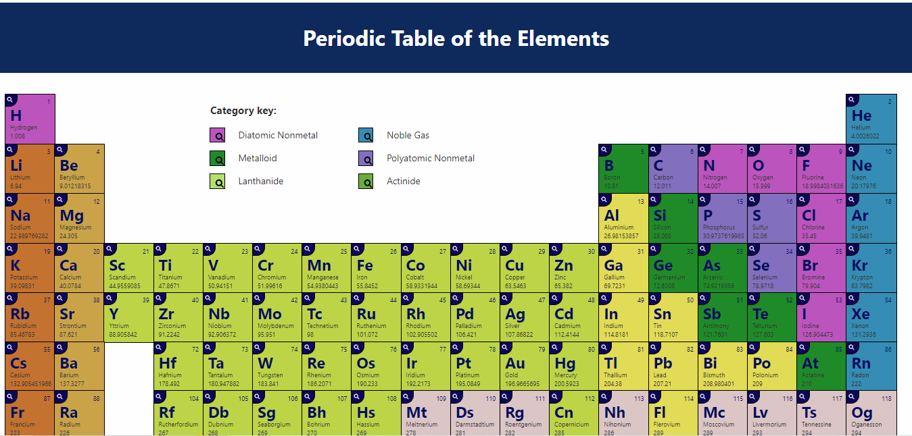

# Periodic Table of the Elements

This project is a responsive Periodic Table of the Elements created using HTML, CSS, and JavaScript. The data for the elements is sourced from the [Periodic-Table-JSON](https://github.com/Bowserinator/Periodic-Table-JSON) repository, which is licensed under the Attribution-ShareAlike 3.0 Unported (CC BY-SA 3.0) license.

## Features

- **Responsive Design**: The periodic table is fully responsive and adjusts to different screen sizes for optimal viewing on any device.
- **Data-Driven**: All element data is dynamically loaded from a JSON file, providing a structured and consistent display of the periodic table.
- **Interactive**: The table allows for interaction and easy identification of elements based on their properties.

## Screenshot

## Getting Started

### Prerequisites

To run this project, you only need a web browser. However, if you'd like to serve the project locally with live reload capabilities, you'll need Node.js and Yarn.

### Installation

#### Clone the Repository

You can clone this repository using Git:

\`\`\`bash
git clone https://github.com/Mahamilyas211/Periodic-table.git
cd periodic-table
\`\`\`

#### Install Dependencies (Optional)

If you plan to modify the project and need a development environment with live reloading, you can install dependencies using Yarn:

\`\`\`bash
yarn install
\`\`\`

### Running the Project

#### Open Directly in Browser

You can simply open the \`index.html\` file in your web browser:

1. **Open the File**:
   - Double-click on the \`index.html\` file.
   - Alternatively, right-click the file and select "Open with" followed by your preferred web browser.

## Deployment

The project is also deployed on Vercel. You can view the live version here:

[Live Demo on Vercel](https://periodic-table-sandy.vercel.app/)

## Data Source

The data comes from the [Periodic-Table-JSON](https://github.com/Bowserinator/Periodic-Table-JSON), a JSON version of the Periodic Table of the Elements, and is used under the [Attribution-ShareAlike 3.0 Unported (CC BY-SA 3.0)](https://creativecommons.org/licenses/by-sa/3.0/) license.

### GitHub Repository

You can find the source code for this project on GitHub from this repo:

[GitHub Repository](https://github.com/Bowserinator/Periodic-Table-JSON), PeriodicTableCSV.csv, PeriodicTableJSON.json files.

